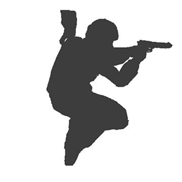

<div align="center">
  

# 击杀确认覆盖层 / Kill Confirm Overlay

**为 Xbox Game Bar 打造的可自定义 CS2 击杀确认体验。**

<p>
  <a href="README.md">English</a> · <strong>简体中文</strong>
</p>

<a href="https://pan.quark.cn/s/1f3cfbcf8d5f?pwd=7Twv"></a>

**提取码：`7Twv`**

<p>
  <a href="https://github.com/eachkinji/CS2KillConfirmOverlay/releases"></a>
  
  
  <a href="LICENSE"></a>
</p>
</div>

## 项目简介

Kill Confirm Overlay 通过 Counter-Strike 2 Game State Integration 接收对局事件，根据事件播放对应语音，并在 Xbox Game Bar 中显示击杀动画。它不读取或注入 CS2 游戏进程，同时可以作为悬浮窗保持在游戏画面上方。

项目已经从简单的击杀确认音效工具，发展为支持独立游戏风格、自定义媒体、连杀逻辑、事件优先级和高分辨率渲染的可配置展示系统。

> [!NOTE]
> 文中其他游戏的名称表示受对应游戏启发的展示风格。当前实际通过 GSI 提供实时对局事件的游戏仍然是 CS2。

> [!CAUTION]
> **免责声明：** 本项目中包含的所有游戏相关资源（音效、图标、角色形象等）归各自版权方所有（Riot Games、Electronic Arts、Valve 等）。本工具为非官方社区项目，仅供学习、交流、测试使用，与上述公司无任何关联、亦未获其认可或赞助。切勿将本工具用于盗版、商业转售或任何违法活动。

## 开源基础与社区联动

<table>
  <tr>
    <td align="center" width="120">
      <a href="https://github.com/st0nie">
        <br />
        <strong>ston · st0nie</strong>
      </a>
    </td>
    <td>
      <strong>感谢 cskillconfirm 原项目开发者</strong><br /><br />
      特别感谢 <a href="https://github.com/st0nie">ston（st0nie）</a> 提供的开发思路，以及开源项目 <a href="https://github.com/st0nie/cskillconfirm"><code>cskillconfirm</code></a> 的基础代码。其 CS2 击杀确认方案为本项目提供了重要基础。本项目也使用了 <a href="https://github.com/st0nie/gsi-cs2-rs"><code>gsi-cs2-rs</code></a> 的相关思路与集成成果。
    </td>
  </tr>
  <tr>
    <td align="center" width="120">
      <a href="https://github.com/gufan0000">
        <br />
        <strong>gufan0000</strong>
      </a>
    </td>
    <td>
      <strong>更多 CS2 自定义需求：CS2 Customizer</strong><br /><br />
      如果你需要更丰富的个性化修改，包括准心、击杀音效与图标、HUD 配色、局内视角和道具瞄点，请访问 <a href="https://github.com/gufan0000/cs2-customizer"><code>gufan0000/cs2-customizer</code></a>。本项目与其深度联动，可以配合形成更完整的 CS2 自定义体验。
    </td>
  </tr>
</table>

## 功能亮点

- **Xbox Game Bar 悬浮窗**：使用 `Win + G` 打开、定位、缩放并固定组件。
- **击杀事件识别**：支持普通击杀、爆头、刀杀、首杀、最后一杀、助攻、连杀和观察队友等事件。
- **11 种内置展示风格**：穿越火线、CSOL、VALORANT、战地 1、战地 5、战地 4、战地 2042、PUBG、三角洲行动、豆包和大狗叫。
- **灵活的连杀逻辑**：支持按生命、按回合和循环连杀窗口；循环点可在 2–50 杀之间设置。
- **自定义图片与语音**：可使用内置素材，也可为支持的事件和风格导入图片、语音资源。
- **自定义模块**：兼容 CS2 Customizer 击杀图标序列帧，支持 ZIP/旧版目录导入、预览、播放调节和兼容导出。详见[格式与使用说明](docs/CustomModule.md)。
- **高级音频控制**：支持独立风格优先级、音量、事件音效以及可配置的播放速度与音调变化。
- **炸弹音效时间线**：可选安放、拆除、爆炸和新回合重置音效，并可设置初始与最终倍速，由程序在 40 秒内平滑加速。
- **高分辨率视觉优化**：针对高 DPI 显示器和 4:3 全屏分辨率优化渲染、定位与缩放。
- **独立配置保存**：游戏风格、素材包、动画和高级设置分别持久化，减少不同风格之间的互相影响。
- **双语界面与更新检测**：支持英文、简体中文界面，并在组件打开时检测最新正式 GitHub Release。

## 工作原理

```text
CS2 Game State Integration
            ↓
127.0.0.1:10087 上的本地 Rust 服务
            ↓
事件分类与音频播放
            ↓
Xbox Game Bar 动画悬浮窗
```

本地服务接收 GSI 数据，小组件再根据当前风格和事件优先级，选择对应的动画、图片与音频。

## 使用要求

- Windows 10 或 Windows 11
- 已启用 Xbox Game Bar
- Counter-Strike 2

## 安装

1. 从[夸克网盘](https://pan.quark.cn/s/1f3cfbcf8d5f?pwd=7Twv)下载，提取码为 `7Twv`；也可以访问 [GitHub Releases](https://github.com/eachkinji/CS2KillConfirmOverlay/releases)。
2. 根据当前环境选择安装包：
   - **有依赖版——推荐新用户使用**：包含首次安装所需依赖。
   - **无依赖版——推荐更新使用**：适合已经能够正常运行旧版本的系统。
3. 运行安装程序。
4. 按 `Win + G` 打开 Xbox Game Bar，找到 Kill Confirm Overlay，并根据需要固定组件。
5. 启动 CS2。安装程序会尝试自动配置 Game State Integration。

## CS2 Game State Integration

悬浮窗监听地址：

```text
http://127.0.0.1:10087/
```

安装程序会尝试自动创建所需的 GSI 配置。如果事件没有触发，请将 `KillConfirmService/gsi/gamestate_integration_killconfirm.cfg` 复制到：

```text
C:\Program Files (x86)\Steam\steamapps\common\Counter-Strike Global Offensive\game\csgo\cfg\
```

上游参考配置可在 [`gsi-cs2-rs`](https://github.com/st0nie/gsi-cs2-rs/blob/main/gsi_cfg/gamestate_integration_fast.cfg) 中查看。

## 常见问题

- **击杀后没有语音或动画**：检查本地服务是否运行，以及 GSI 文件是否位于正确的 CS2 `cfg` 目录。
- **正在使用 Clash 或其他系统代理**：请关闭系统代理，或排除 `127.0.0.1`。部分代理配置会拦截本地流量，导致服务无法收到 GSI 事件。
- **更新已有安装**：只有在旧版本及其依赖已经正常运行时，才建议使用无依赖安装包。
- **导入自定义内容**：请只使用来源可信的素材包和语音包。

## 从源码构建

源码构建需要 Rust 工具链、安装了 Windows/UWP/MSIX 工具的 Visual Studio 或 Visual Studio Build Tools；如需生成 `.exe` 安装器，还需要 Inno Setup 6。

在仓库根目录运行：

```powershell
.\Build-IntegratedPackage.ps1
```

创建可转移安装包：

```powershell
.\Build-TransferPackage.ps1
```

创建安装器：

```powershell
.\Build-Installer.ps1
```

## 项目结构

- `KillConfirmService`：负责 GSI 事件处理和音频播放的 Rust 本地服务。
- `Widget`：Xbox Game Bar 界面、设置与视觉效果。
- `Package`：Windows 打包项目。
- `Installer`：安装器定义和相关文件。
- `SourceAssets`：源动画、图片、音频、图标和内置风格素材。

构建时会从 `SourceAssets` 刷新最终打包所需的资源。

## 其他致谢

- MinecraftGD656 的 [`gd656killicon`](https://github.com/MinecraftGD656/gd656killicon)。
- [Steam 创意工坊项目 2721562982](https://steamcommunity.com/sharedfiles/filedetails/?id=2721562982)。

本项目包含由 AI 生成的代码。

## 许可证与免责声明

本项目使用 [GNU Affero General Public License v3.0](LICENSE) 开源。

本项目与 Valve、Microsoft、Xbox、CrossFire、Riot Games、Electronic Arts、Krafton、Tencent、ByteDance 或其他游戏发行商不存在官方关联。文中涉及的产品名称和商标均归各自所有者所有。

## Star 趋势

<a href="https://www.star-history.com/?repos=eachkinji%2FCS2KillConfirmOverlay&type=date&legend=top-left">
 <picture>
   <source media="(prefers-color-scheme: dark)" srcset="https://api.star-history.com/chart?repos=eachkinji/CS2KillConfirmOverlay&type=date&theme=dark&legend=top-left&sealed_token=JO7S8AitdgsgeJkQQ1VllxXemOmgTJQ-vAfDJhdhXyaUKJP8neUInbQMV4bHYN9Aaarxe8b3i-QFSwDPZ433U1Z9UTz-jUm5N7_QyCB14Vr4I_hZFmNsRLww_4Qv1JAy73-VLpPKkTCopmcWViZh301QwvH6kMdPHYykp-TiTPiWZIFEcl_UIunjQQiK" />
   <source media="(prefers-color-scheme: light)" srcset="https://api.star-history.com/chart?repos=eachkinji/CS2KillConfirmOverlay&type=date&legend=top-left&sealed_token=JO7S8AitdgsgeJkQQ1VllxXemOmgTJQ-vAfDJhdhXyaUKJP8neUInbQMV4bHYN9Aaarxe8b3i-QFSwDPZ433U1Z9UTz-jUm5N7_QyCB14Vr4I_hZFmNsRLww_4Qv1JAy73-VLpPKkTCopmcWViZh301QwvH6kMdPHYykp-TiTPiWZIFEcl_UIunjQQiK" />
   
 </picture>
</a>
